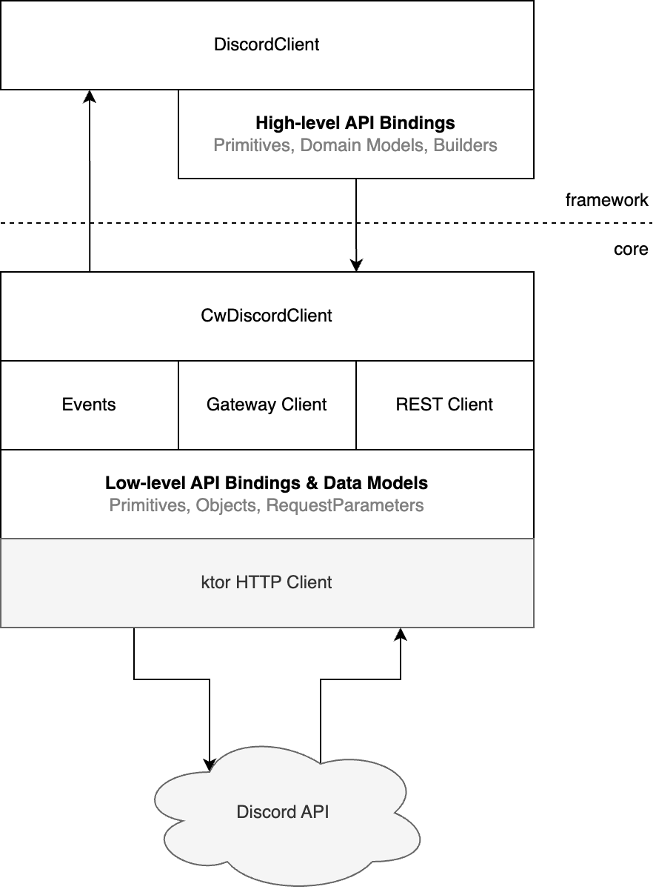

# Architecture Overview

Cogwheel consists of two modules: `core` and `framework`. The `core` implements base infrastructures 
required to interact with the Discord API, while `framework` is built on top of `core` to provide 
additional high-level abstractions. These allow developers to work with the library in a secure and
idiomatic way. 

In most general cases, bot developers are expected consume the `framework` module. Building off the 
`core` module is only necessary if developers wish to design their own high-level abstractions without
the hassle of defining low level data models. 

## Architecture Diagram

Key components of the library internals is summarised in the diagram below:

**Remarks**
* It is expected for bot developers to work with the library through the public API provided by
`DiscordClient`. 
* Bot developers can submit requests (inputs) to Discord API via high-level API bindings provided by
`framework` OR use `CwDiscordClient` the bindings delegate to. 
* If the Discord client is configured to connect to Discord's Gateway API, gateway events can be
subscribed to in `CwDiscordClient` (core) or in `DiscordClient` (framework). These are modeled as 
`Events` in the diagram.

## Design Philosophy

**For `core`**
* The module should match Discord API as closely as possible, so to facilitate easy lookup of objects
and API definitions for developers reading through Discord's official documentation.
* Data models and public API should be defined in a way that maximizes compatibility with any 
backward-compatible changes in the Discord platform.
* As a result of the above, it is preferable to use primitive types to represent data model fields as
they are more permissive. Unknown values should either be deserializable and left to the application 
developer to handle, or ignored.
* The module is closed for extension from the outside -- any additions required to work with new 
Discord API results in a new version of the `core` library, rather than attempting to support bot 
developers to define new models or resources.

**For `framework`**
* This module should make development with the framework as intuitive, concise and secure as possible. 
In particular, this refers to providing idiomatic public APIs, and making use of stricter data types. 
* This module is only focused on supporting the intended target Discord API version.
* This module is closed for extension from the outside, like `core`.
